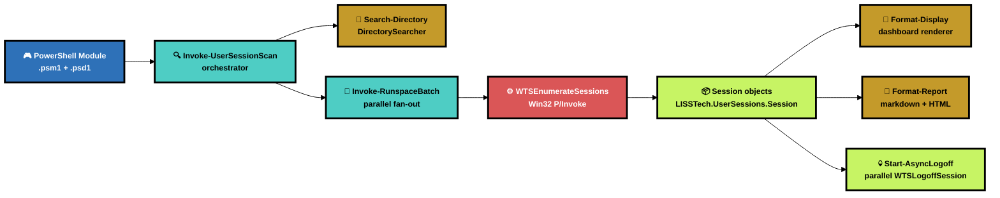
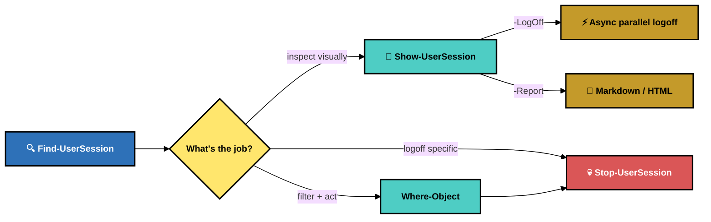

# LISSTech.UserSessions

**Enumerate, audit, and log off Terminal Services sessions across Active Directory — with a dashboard, async parallel logoff, and ticket-ready reports.**

[](https://www.powershellgallery.com/packages/LISSTech.UserSessions)
[](https://learn.microsoft.com/powershell/)
[](https://docs.microsoft.com/windows-server/)
[](LICENSE)
[](https://calver.org/)

[**Quick Start**](#-quick-start) · [**Architecture**](#%EF%B8%8F-architecture) · [**PowerShell API**](#-powershell-api) · [**Reports**](#-reports) · [**Building**](#-building) · [**Structure**](#-project-structure)

---

## 📑 Table of Contents

- [⚡ Quick Start](#-quick-start)
- [🏗️ Architecture](#%EF%B8%8F-architecture)
- [🎮 PowerShell API](#-powershell-api)
- [📝 Reports](#-reports)
- [🔨 Building](#-building)
- [📁 Project Structure](#-project-structure)
- [🔒 Safety](#-safety)

---

## ⚡ Quick Start

```powershell
# Install from PSGallery
Install-Module LISSTech.UserSessions

# Dashboard view — scan every reachable computer in AD, render panels
Show-UserSession

# Scripting surface — emit session objects for pipeline composition
Find-UserSession -Username jmariano | Where-Object IdleTime.TotalDays -gt 7

# Maintenance-window canonical: scan, log everyone off, drop a ticket-ready
# markdown summary on the clipboard in one command
Show-UserSession -LogOff -Confirm:$false -Report markdown
```

---

## 🏗️ Architecture



| Layer | Role | Details |
|---|---|---|
| 🎮 **PowerShell module** | User-facing API | Three public cmdlets (`Find-`/`Show-`/`Stop-UserSession`), zero external module dependencies. |
| 🏢 **DirectorySearcher** | AD lookups | `System.DirectoryServices.DirectorySearcher` for user + computer enumeration. No ActiveDirectory RSAT module required. |
| 🏃 **RunspacePool** | Parallelism | Scans and logoff operations fan out across a `RunspacePool` — throttled, PS 5.1-compatible. |
| ⚙️ **WTS P/Invoke** | Session data | `WTSEnumerateSessions` + `WTSQuerySessionInformation` via P/Invoke. Locale-proof, no `quser.exe` parsing. |
| 🎨 **Dashboard** | Display | 256-color ANSI with VT processing auto-enabled; box-drawing panels, Cylon-style async logoff progress bars. |
| 📝 **Reports** | Ticket artifacts | Markdown (clipboard by default) and self-contained neobrutal HTML (browser preview by default). |

---

## 🎮 PowerShell API

### Cmdlets

| Cmdlet | Role |
|---|---|
| `Find-UserSession` | Emit session objects for pipeline composition |
| `Show-UserSession` | Dashboard render + optional async logoff + optional report |
| `Stop-UserSession` | Pipeline-bound single-session logoff with ShouldProcess |

### Flow



### `Find-UserSession`

```powershell
Find-UserSession
    [-UserSearchBase <string[]>]      # AD OUs to filter users from
    [-Username <string[]>]            # explicit SAM account names
    [-ComputerName <string[]>]        # explicit computers (alias: Server, Name)
    [-ComputerLdapFilter <string>]    # LDAP filter narrowing AD computer discovery
    [-ThrottleLimit <int>]            # parallel scan concurrency (default 16)
    [-PingTimeoutMs <int>]            # reachability timeout (default 2000)
    [-SkipConnectivityCheck]          # skip the ping sweep
```

Emits `LISSTech.UserSessions.Session` objects with properties:
`Server`, `SessionId`, `Username`, `Domain`, `WinStation`, `State`, `LogonTime`,
`LastInputTime`, `IdleTime`, `IsCurrent`, `IsUserDisabled`.

### `Show-UserSession`

```powershell
Show-UserSession
    [-UserSearchBase] [-Username] [-ComputerName] [-ComputerLdapFilter]
    [-ThrottleLimit] [-PingTimeoutMs]
    [-OnlyDisconnected]               # filter to Disconnected-state sessions
    [-OnlyDisabled]                   # filter to sessions for disabled AD users
    [-MinIdleDays <int>]              # filter by idle time
    [-LogOff]                         # async parallel logoff after render
    [-Report markdown|html]           # generate ticket-ready artifact
    [-ReportPath <string>]            # explicit output file (no auto-open)
    [-Clipboard]                      # also copy to clipboard
```

### `Stop-UserSession`

```powershell
Stop-UserSession
    -ComputerName <string>            # alias: Server, Name
    -SessionId <int>
    [-Username] [-State] [-IsCurrent]  # typically from pipeline binding
    [-PassThru]
```

Accepts pipeline input from `Find-UserSession` via property binding —
`IsCurrent` sessions are skipped unconditionally.

---

## 📝 Reports

`Show-UserSession -Report` generates a ticket-ready artifact capturing the
scan snapshot, the filter scope, per-server session tables, and (when
combined with `-LogOff`) the logoff tally and any failures.

### Behavior matrix

| Combination | Output |
|---|---|
| `-Report markdown` | Plain-text clipboard (default) |
| `-Report html` | **Rendered HTML clipboard (CF_HTML) + browser preview** |
| `-Report markdown -ReportPath x.md` | File only |
| `-Report markdown -ReportPath x.md -Clipboard` | File + clipboard |
| `-Report html -ReportPath x.html` | File only — silent attachment mode (no browser, no clipboard) |
| `-Report html -ReportPath x.html -Clipboard` | File + rendered clipboard |
| `-Report html -Clipboard:$false` | Browser preview only, clipboard untouched |
| `-ReportPath foo.md` (no `-Report`) | Format inferred from extension |

### Markdown format

Clean GitHub/HaloPSA-friendly tables. Designed for direct paste into ticket
systems. Includes operator identity, timestamp, scope, logoff result (if
applicable), summary, per-server tables, disabled-user section, offline
hosts, and errored hosts grouped by message.

### HTML format — neobrutal

Self-contained single-file document with inline CSS, no external dependencies.

- **Thick black borders** (3-4px solid), saturated flat colors, heavy drop shadows
- **Chunky typography** — 900-weight headings, tabular-numeric data
- **Print-friendly** `@media print` strips shadows and colored backgrounds
- **Color-coded states** — green for active, amber for disconnected, red for errors/disabled
- **Logoff result banner** — giant icon card with count, green/amber/red by outcome

Pastes as formatted content into HTML-aware editors. Print-to-PDF produces
a clean report attachment.

---

## 🔨 Building

Requires: [just](https://github.com/casey/just), [Pester](https://pester.dev) 5.x.

```
just              # list all recipes
just test         # 🧪 run Pester test suite
just lint         # 🔍 PSScriptAnalyzer + BOM verification
just bom          # 📝 apply UTF-8 BOM to all .ps1/.psm1/.psd1/.md
just bump         # 🔖 bump CalVer (YY.DOY.patch)
just package      # 📦 build distributable zip
just release      # 🚀 lint → test → package → sign
just publish      # 📤 release + publish to PSGallery
just clean        # 🧹 remove dist/ and any temp files
```

### Release pipeline

```mermaid
%%{init: {'theme': 'base', 'themeVariables': {'fontFamily': 'monospace', 'fontSize': '13px', 'primaryBorderColor': '#000', 'lineColor': '#000'}}}%%
graph LR
    A["🔍 lint"] --> B["🧪 test"]
    B --> C["📝 BOM"]
    C --> D["📦 package"]
    D --> E["🔏 sign"]
    E --> F["📤 PSGallery"]

    classDef mint fill:#4ECDC4,stroke:#000,stroke-width:2px,color:#000,font-weight:bold
    classDef blue fill:#2E71B8,stroke:#000,stroke-width:2px,color:#fff,font-weight:bold
    classDef amber fill:#C49A2A,stroke:#000,stroke-width:2px,color:#000,font-weight:bold
    classDef red fill:#DA5657,stroke:#000,stroke-width:2px,color:#fff,font-weight:bold
    classDef green fill:#C7F464,stroke:#000,stroke-width:2px,color:#000,font-weight:bold

    class A mint
    class B,C blue
    class D amber
    class E red
    class F green
```



### Environment variables

Configure via `.env` (see `.env.example`):

| Variable | Required | Description |
|---|---|---|
| `CODE_SIGNING_CERTIFICATE_THUMBPRINT` | ⬜ | SHA-1 thumbprint from Windows certificate store. Omit to skip signing. |
| `PSGALLERY_API_KEY` | ⬜ | API key for [PSGallery](https://www.powershellgallery.com/account/apikeys). Required for `just publish`. |

---

## 📁 Project Structure

```
📦 LISSTech.UserSessions
├── 📂 docs/
│   ├── 📂 assets/brand/                     # Logo and brand marks
│   └── 📄 (technician guides)                # Per-client procedural guides
├── 📂 Private/                              # Implementation details
│   ├── 🔧 Types.ps1                         # P/Invoke type registration
│   ├── 🔧 Invoke-RunspaceBatch.ps1          # Parallel helper
│   ├── 🎨 Format-Display.ps1                # Dashboard renderer + async logoff
│   ├── 🏃 Workers.ps1                       # Scan worker scriptblocks
│   ├── 🏢 Search-Directory.ps1              # DirectorySearcher wrapper
│   ├── 🔍 Invoke-UserSessionScan.ps1        # Orchestrator
│   └── 📂 Reporting/                        # Report subsystem (SOLID-shaped)
│       ├── 📊 ReportModel.ps1               # View-model shaping
│       ├── 🎨 ReportStyles.ps1              # Design tokens + CSS
│       ├── 🧩 ReportHtmlSections.ps1        # Pure section renderers
│       ├── 📄 ReportHtml.ps1                # HTML composer
│       ├── 📝 ReportMarkdown.ps1            # Markdown composer
│       └── 🚚 ReportDispatch.ps1            # File/clipboard/browser side effects
├── 📂 Public/                               # Exported cmdlets
│   ├── 🔍 Find-UserSession.ps1
│   ├── 🎨 Show-UserSession.ps1
│   └── 💀 Stop-UserSession.ps1
├── 📂 scripts/
│   ├── 🔧 Apply-Bom.ps1                     # Build-time BOM enforcement
│   └── 🔖 Bump-Version.ps1                  # CalVer bumper
├── 📂 tests/
│   └── 📂 LISSTech.UserSessions.Tests/      # Pester 5.x BDD suites
│       ├── 📄 Module.Tests.ps1              # Manifest, BOM, parser contracts
│       └── 📄 ReportRendering.Tests.ps1     # Given/When/Then for rendering
├── 📄 LISSTech.UserSessions.psd1            # Manifest
├── 📄 LISSTech.UserSessions.psm1            # Module loader
├── 📄 profile-snippet.ps1                   # Per-site defaults template
├── 📄 CHANGELOG.md
├── 📄 README.md
├── 📄 LICENSE                               # Apache 2.0
├── 📄 CLAUDE.md                             # AI pair-programming conventions
├── 📄 justfile                              # Build recipes
├── 📄 .env.example
└── 📄 .gitignore
```

---

## 🔒 Safety

| Measure | Details |
|---|---|
| ⭐ **Own-session guard** | `Show-UserSession -LogOff` and `Stop-UserSession` skip `IsCurrent` sessions unconditionally. You cannot log yourself out. |
| 🧪 **ShouldProcess** | Both destructive cmdlets support `-WhatIf` and `-Confirm`. Bulk logoffs use a single batch-level confirmation. |
| 🔐 **Read-only by default** | `Show-UserSession` without `-LogOff` is pure display. No side effects. |
| 📜 **Audit trail** | `-Report` produces timestamped artifacts with operator identity, scope, and outcome counts for ticket attachment. |
| 🌐 **No external deps** | Pure PowerShell + built-in .NET (`DirectorySearcher`, `System.Management.Automation`, Win32 P/Invoke). Runs out-of-box on domain-joined Windows. |
| ⚠ **Offboarding visibility** | Disabled AD users with live sessions are highlighted in both the dashboard and reports. Disabling an account does not end its sessions — this tool finds them. |

---

[](https://www.powershellgallery.com/packages/LISSTech.UserSessions)
[](https://calver.org/)

**LISS Consulting, Corp.** · *Terminal Services, respectfully.*
